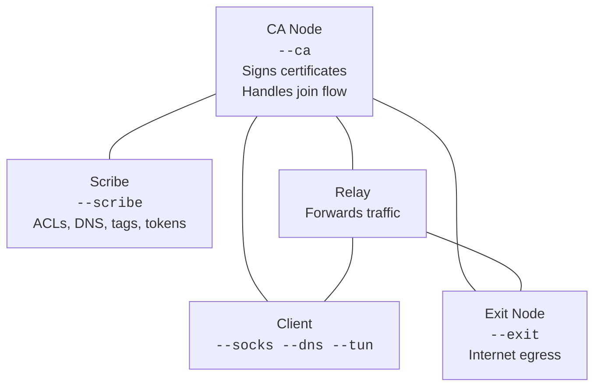
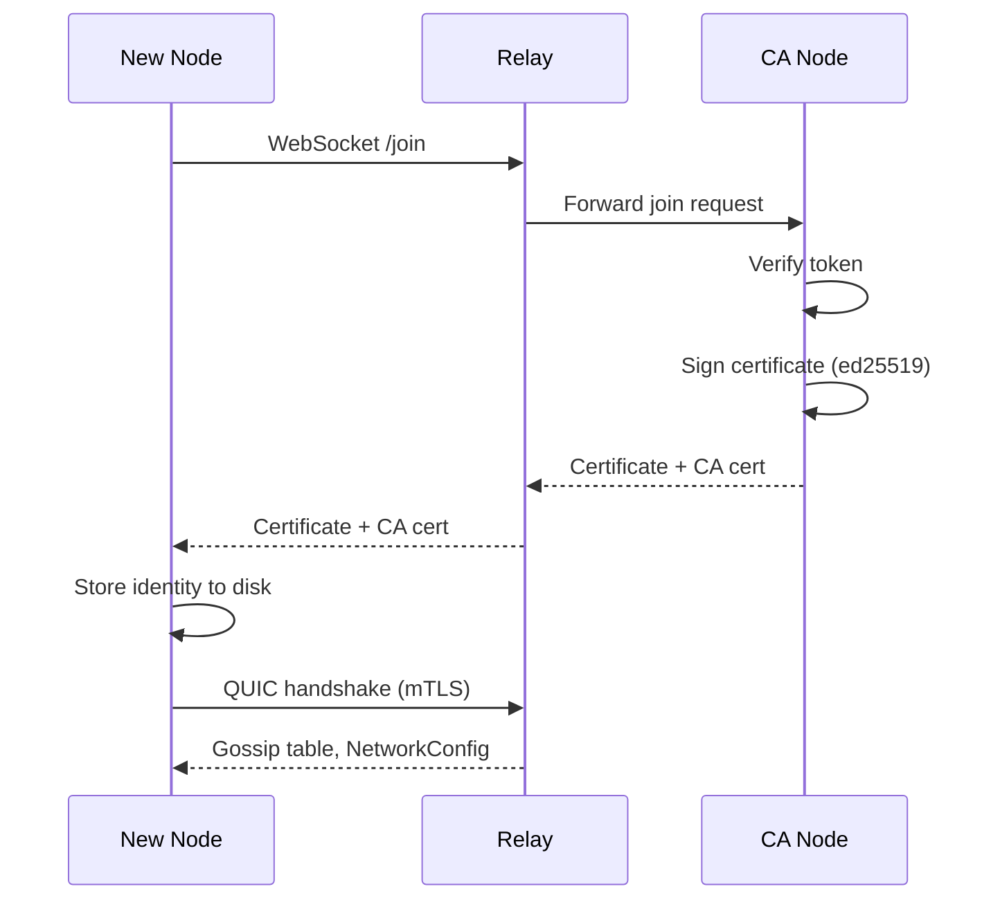
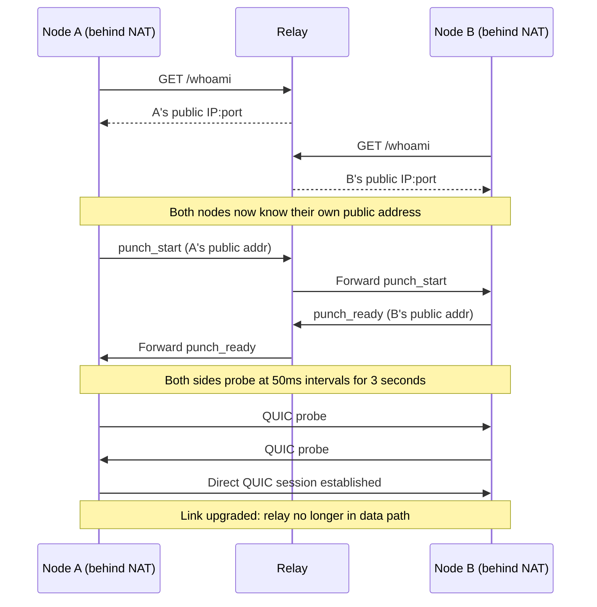
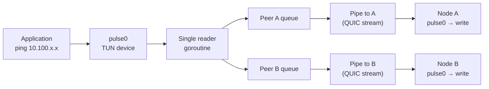
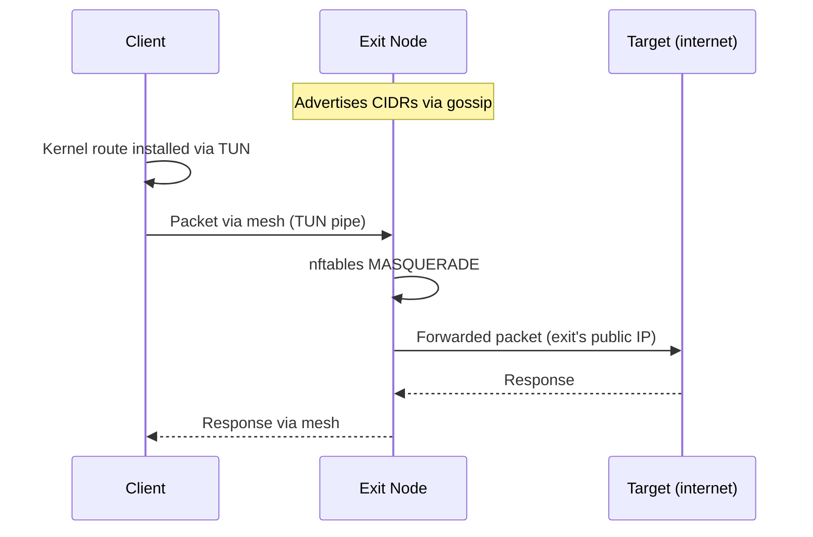

# pulse

[](https://github.com/leonardomb1/pulse/actions/workflows/ci.yml)
[](https://opensource.org/licenses/MIT)
[](https://go.dev/)
[](https://github.com/leonardomb1/pulse/releases)
[](https://goreportcard.com/report/github.com/leonardomb1/pulse)

An easy-to-configure encrypted mesh network in a single binary. Nodes discover each other via gossip, traffic is routed by measured link quality, and the whole thing is managed from the CLI or an interactive TUI.

## What it does

- **Encrypted mesh** between any number of nodes over QUIC (with WebSocket fallback)
- **Layer 3 VPN** via TUN interface — mesh IPs just work like a LAN
- **NAT traversal** — automatic QUIC hole punching for direct peer-to-peer links
- **Weighted multipath routing** — traffic distributed across paths by inverse-score weighting (better paths get more traffic)
- **Delta-gossip** — only changed entries are sent per gossip round (80-95% bandwidth reduction)
- **FEC** — optional forward error correction on TUN pipes for lossy links (recovers single packet loss without retransmit)
- **Exit nodes** — forward traffic to the internet through designated nodes
- **Tag-based ACL policies** — `tag:dev` can't reach `tag:prod`, first-match firewall rules
- **DNS** for the `.pulse` TLD — `ssh user@db-server.pulse`
- **SOCKS5 proxy** — transparent mesh routing for any application
- **Network isolation** — separate pulse deployments with `--network` IDs
- **Interactive TUI** (`pulse top`) — k9s-style dashboard for managing the mesh
- **Prometheus metrics** — `/metrics` endpoint for Grafana/alerting
- **Traffic counters** — bytes in/out and active connections per node, reported to scribe
- **Link type visibility** — `direct_quic`, `quic`, or `websocket` shown per peer in CLI, TUI, and metrics

## Architecture



**Two control roles (can be on the same or different machines):**

- **CA** — certificate authority. Signs node certificates, handles the join flow.
- **Scribe** — network config authority. Manages ACLs, DNS zones, tags, names, revocations, and join tokens. Distributes signed config to all nodes.

Every node is also a **relay** that forwards traffic for other nodes. Roles are composable — a single node can be CA + scribe + relay + exit.

## Use cases

### Remote development

A developer has a workstation at home and a cloud VM running services. Both run pulse with TUN enabled. The workstation connects to `postgres.vm-01.pulse:5432` as if it were local. No port forwarding, no VPN provider, no firewall rules.

### Multi-site infrastructure

Three offices each have a pulse node. A cloud relay bridges them. Nodes discover each other through gossip and route traffic over the lowest-latency path. If the direct path between two offices goes down, traffic reroutes through the relay automatically.

### Controlled access for contractors

A contractor needs temporary SSH access to a staging server. The operator creates a single-use, time-limited token (`pulse token create --ttl 4h --max-uses 1`), sends it to the contractor, and tags their node `tag:contractor`. An ACL rule restricts `tag:contractor` to port 22 on `tag:staging` only. When the token expires, the contractor can no longer join.

### Exit routing

A team needs all outbound traffic from their mesh to egress through a specific data center (compliance, geo-restrictions). One node in that data center runs as an exit node with `--exit --exit-cidrs 0.0.0.0/0`. All other nodes automatically learn the exit route via gossip and forward matching traffic through the exit node's SOCKS proxy.

### IoT / edge deployment

Embedded devices behind carrier-grade NAT join the mesh through a cloud relay. The NAT manager detects the indirect path and punches through to establish direct QUIC links between devices. The relay handles signaling only — data flows peer-to-peer at ~1ms instead of ~100ms through the relay.

## Quickstart

All configuration is via CLI flags and signed state from the scribe. No config files.

```bash
# Build
go build -o pulse ./cmd/pulse/

# On a server with a public IP — start as CA:
pulse --ca --scribe --addr relay.example.com:443 --listen :443 \
      --network mynet --token $(openssl rand -hex 32)

# On another machine — join the mesh:
pulse join relay.example.com:443 --token <token>
# Or with an invite code (encodes relay + token + network):
pulse join pls_eyJyIjoicmVsYXkuZXhhbXBsZS5jb206NDQzIiwidCI6Im15dG9rZW4ifQ

# Start with services enabled:
pulse start --socks --dns --tun --network mynet relay.example.com:443

# Generate an invite code to share with others:
pulse invite --network mynet

# Check status:
pulse status
pulse top     # interactive TUI
```

## CLI Reference

### Lifecycle

```
pulse [flags] [peers...]              Start in foreground
pulse start [flags] [peers...]        Start as background daemon
pulse stop                            Graceful shutdown
pulse id                              Print node ID and mesh IP
pulse cert                            Show certificate expiry and status
pulse top                             Interactive TUI dashboard
```

### Mesh

```
pulse join <relay> --token <tok>      Join a mesh (one-time)
pulse join <pls_code>                 Join using an invite code
pulse invite [--network <id>]         Generate an invite code (CA only)
pulse status                          Show mesh status table
pulse tag <node-id> <tag>             Add a tag to a node
pulse untag <node-id> <tag>           Remove a tag
pulse name <node-id> <name>           Set a friendly name
pulse revoke --node <id>              Revoke a node's certificate
```

### Policy

```
pulse acl list                        Show ACL rules
pulse acl add --from <pat> --to <pat> Add a rule (--deny, --ports 22,443)
pulse acl remove <index>              Remove a rule by index
```

ACL patterns: node ID globs (`a3f2*`), tags (`tag:prod`), names (`db-server`), or `*`.

Rules are evaluated top-to-bottom, first match wins. No rules = open by default. Adding any rule activates policy mode (unmatched = deny).

### Tokens

```
pulse token                           Show legacy master token (CA only)
pulse token create --ttl 1h           Create a time-limited token
pulse token create --max-uses 1       Create a single-use token
pulse token list                      List all tokens
pulse token revoke <prefix>           Revoke a token
```

### Networking

```
pulse connect --node <id> --dest <addr>   SSH ProxyCommand tunnel
pulse forward --node <id> --dest <addr> --local <addr>   Port forward
pulse dns list|add|remove             Manage DNS records
pulse route list|add|remove           Manage exit routes
```

### Admin

```
pulse ca log                          View CA audit log
pulse ca sign --ca-dir <dir> ...      Offline cert signing
pulse setup dns                       Configure systemd-resolved for .pulse (see below)
pulse completion <bash|zsh|fish>      Generate shell completions
```

To enable tab completion:

```bash
# Bash (add to ~/.bashrc):
eval "$(pulse completion bash)"

# Zsh (add to ~/.zshrc):
eval "$(pulse completion zsh)"

# Fish:
pulse completion fish | source
```

#### Setting up .pulse DNS resolution

`pulse setup dns` configures `systemd-resolved` so that `.pulse` domains (e.g. `ssh user@db.pulse`) resolve through pulse's built-in DNS server. It requires `sudo` because it writes a system-level config file.

What it does:

1. Writes `/etc/systemd/resolved.conf.d/pulse.conf` with the pulse DNS address and `Domains=~pulse`
2. Restarts `systemd-resolved` to apply the change

```bash
sudo pulse setup dns
```

After running this, any `.pulse` lookup on the machine is routed to pulse's DNS server. All other DNS queries continue to use the system default.

To undo, remove the file and restart resolved:

```bash
sudo rm /etc/systemd/resolved.conf.d/pulse.conf
sudo systemctl restart systemd-resolved
```

## Node Flags

```
--data-dir <path>      Data directory (default ~/.pulse)
--addr <addr>          Advertised address (default :8443)
--listen <addr>        Bind address (default: same as --addr)
--tcp <addr>           TCP tunnel listener (default :7000)
--network <id>         Network isolation ID
--join <addr>          CA relay address (auto-join on startup)
--token <secret>       Join token
--log-level <level>    debug, info, warn, error (default: info)
```

## Feature Flags

```
--ca                   Certificate authority
--ca-token <secret>    Token the CA accepts (defaults to --token)
--scribe               Control plane (ACLs, DNS, tags, dashboard)
--scribe-listen <addr> Scribe HTTP API (default 127.0.0.1:8080)
--socks                SOCKS5 proxy
--socks-listen <addr>  SOCKS5 address (default 127.0.0.1:1080)
--dns                  DNS server for .pulse TLD
--dns-listen <addr>    DNS address (default 127.0.0.1:5353)
--tun                  TUN interface for layer 3 routing (Linux)
--fec                  Forward error correction on TUN pipes (lossy links)
--exit                 Exit node (forwards traffic to internet)
--exit-cidrs <cidrs>   Comma-separated CIDRs this exit node advertises (e.g. 0.0.0.0/0)
```

## How it works

### Join Flow



### NAT Hole Punch



### Transport

Nodes try QUIC first (no head-of-line blocking, 0-RTT reconnect), fall back to WebSocket+yamux if UDP is blocked. Transport selection is transparent — both return the same `Session` interface. QUIC sessions support connection migration — when a node's NAT rebinds (wifi to 4G), the session survives without reconnecting.

Link types visible in `pulse status`:

| Type | Meaning | Typical latency |
|------|---------|----------------|
| `direct_quic` | Direct P2P link established via NAT hole punch | Lowest — no relay in data path |
| `quic` | Direct QUIC to a publicly reachable peer | Same as direct_quic — both are UDP |
| `websocket` | Relay-mediated via WebSocket+yamux over TCP | +1-5ms per relay hop, head-of-line blocking |
| `-` | No active session (gossip-only, not connected) | N/A |

The NAT manager runs a 30-second punch cycle. When two nodes are both behind NAT, the manager coordinates through the relay: node A sends `punch_start` to B via the relay, B replies `punch_ready`, then both sides send QUIC probes to each other at 50ms intervals over a 3-second window. First successful handshake wins. If both nodes are on the same LAN, the manager uses the gossip-announced address directly without needing `/whoami`.

### Gossip (Delta)

Every 10 seconds, each node sends **only changed entries** to its neighbors (delta-gossip). Each table entry is stamped with a version counter; peers track which version they last received. A full table push is forced every 60 seconds as a fallback. Stale entries (not seen in 5 minutes) are pruned. Max hop count: 16.

### Routing (Weighted Multipath)

The router scores each path using:

```
score = latency_ms * (1 + 5*loss_rate) * (1 + 0.3*hop_count)
```

A 2-hop path at 5ms beats a 1-hop path at 200ms. When multiple viable paths exist, traffic is distributed using **inverse-score weighted random selection** — a 5ms path gets ~10x more streams than a 50ms path.

### TUN (Layer 3 VPN)



Each node gets a deterministic mesh IP (`10.100.x.x`) derived from its node ID. The `pulse0` TUN interface handles routing at the kernel level. Exit node CIDRs are auto-learned from gossip and installed as kernel routes via raw netlink (no iptables or iproute2 binaries needed — works with just `CAP_NET_ADMIN`).

The packet path uses a WireGuard-inspired pipeline: single TUN reader, per-peer write queues with batch draining, and persistent bidirectional pipes per peer. No per-packet stream setup overhead.

Optional **FEC** (forward error correction) can be enabled for lossy links (`--fec` or `[tun] fec = true`). For every 10 data packets, 1 XOR parity packet is sent. The receiver can reconstruct any single lost packet without retransmission — 10% bandwidth overhead for significant latency improvement on lossy links.

### Exit Nodes



A node with `--exit --exit-cidrs 10.0.0.0/8` advertises itself as an exit for that CIDR in gossip. Other nodes auto-learn the route and install it in their kernel routing table via the TUN device. Traffic matching the CIDR is forwarded through the mesh to the exit node, which masquerades it (nftables MASQUERADE via raw netlink) and sends it out its default interface.

The SOCKS proxy also respects exit routes — any SOCKS-aware application can route traffic through exit nodes without TUN.

### Traffic Counters

Every tunnel and SOCKS connection counts bytes transferred with atomic counters. Each node reports its traffic stats (bytes in/out, active connections) to the scribe every 10 seconds. The scribe aggregates stats from all nodes and exposes them via Prometheus metrics and the TUI. When the TUI runs on the scribe node, it shows per-node TX/RX/CONNS columns.

### Certificate Lifecycle

- CA cert: 10 years
- Node certs: 90 days, auto-renewed when <30 days remain
- Renewal happens through the mesh (re-join flow) — no downtime
- TLS configs use dynamic callbacks — renewed certs are picked up without restart

### Security

- **mTLS** between all peers using CA-signed ed25519 certificates
- **Constant-time** token comparison (timing attack resistant)
- **Peer identity verification** — nodeID must match SHA256 of public key
- **ACL enforcement at every hop** — not just the terminating relay
- **Signed network config** — ACLs, DNS, tags distributed via ed25519-signed NetworkConfig from the scribe
- **SSRF protection** — tunnel DestAddr validated, cloud metadata IPs blocked
- **Network isolation** — `--network` ID checked in handshake, mismatched peers rejected
- **Audit log** — all CA operations (join attempts, cert issuance, revocations) logged with fsync
- **No shelling out** — routing, nftables, and TUN configuration use raw netlink syscalls directly

## HTTP API

The scribe exposes a REST API (default `127.0.0.1:8080`):

| Endpoint | Methods | Purpose |
|----------|---------|---------|
| `GET /api/status` | GET | Full mesh state with per-node traffic stats |
| `GET /api/nodes` | GET | Peer list |
| `GET/PUT /api/config` | GET, PUT | Raw NetworkConfig |
| `GET/POST/DELETE /api/dns` | * | DNS zone CRUD |
| `GET/POST/DELETE /api/acls` | * | ACL rule CRUD |
| `POST/DELETE /api/tags` | * | Node tag management |
| `PUT /api/name` | PUT | Set node name |
| `GET /api/routes` | GET | Exit route table |
| `POST /api/revoke` | POST | Revoke a node |
| `GET/POST/DELETE /api/tokens` | * | Token management |
| `GET /metrics` | GET | Prometheus metrics |

## Prometheus Metrics

```
pulse_peers_total                             # known peers
pulse_peers_connected                         # peers with active sessions
pulse_peer_latency_ms{node_id,name}           # per-peer RTT
pulse_peer_loss_ratio{node_id,name}           # per-peer packet loss
pulse_peer_link_type{node_id,name,type}       # link type per peer (direct_quic/quic/websocket/none)
pulse_node_stats_bytes_in{node_id}            # reported bytes in
pulse_node_stats_bytes_out{node_id}           # reported bytes out
pulse_node_stats_active_conns{node_id}        # reported active connections
pulse_cert_expiry_seconds                     # seconds until cert expires
pulse_acl_rules_total                         # ACL rule count
pulse_tokens_valid                            # usable join tokens
pulse_node_info{node_id,network_id}           # node metadata labels
```

## Node Configuration

All nodes are configured via CLI flags at startup. After joining the mesh, the scribe pushes signed configuration (`~/.pulse/state.dat`) to each node — this persists across restarts. Runtime changes are made through the scribe API, not by editing files.

## Examples

### Home + relay setup

```bash
# Remote server (CA + relay):
pulse --ca --addr relay.example.com:443 --listen :443 \
      --network home --token $(openssl rand -hex 32)

# Home machine (scribe + all services):
pulse join relay.example.com:443 --token <token>
pulse start --scribe --socks --dns --tun --network home relay.example.com:443

# Name your nodes:
pulse name <relay-id> relay-01
pulse name <home-id> home-desktop
pulse tag <relay-id> infra
```

### SSH through the mesh

```bash
# Direct (with TUN enabled):
ssh user@10.100.247.82

# Via DNS:
ssh user@relay-01.pulse

# Via ProxyCommand (no TUN needed):
ssh -o ProxyCommand="pulse connect --node <id> --dest localhost:22" user@relay
```

### Database access across sites

```bash
# TUN gives you a LAN — just connect:
psql -h db-server.pulse -U app

# Or through SOCKS for apps that support it:
psql "host=db-server.pulse port=5432 user=app" \
     --set=PGPROXY="socks5h://127.0.0.1:1080"

# Restrict DB access with ACLs:
pulse acl add --from "tag:backend" --to "tag:db" --ports 5432
pulse acl add --from "*" --to "tag:db" --deny
```

### Access control

```bash
# Allow infra nodes SSH everywhere:
pulse acl add --from "tag:infra" --to "*" --ports 22

# Block dev from prod:
pulse acl add --from "tag:dev" --to "tag:prod" --deny

# Allow DB access on postgres port only:
pulse acl add --from "*" --to "tag:db" --ports 5432
```

### Invite a teammate

```bash
# Generate a single invite code (encodes relay address + token + network):
pulse invite --network myteam
# Output: pls_eyJuIjoibXl0ZWFtIiwiciI6InJlbGF5LmV4YW1wbGUuY29tOjQ0MyIsInQiOiJhYmMxMjMifQ

# The teammate runs:
pulse join pls_eyJuIjoibXl0ZWFtIiwiciI6InJlbGF5LmV4YW1wbGUuY29tOjQ0MyIsInQiOiJhYmMxMjMifQ
pulse start --tun --socks
```

### Time-limited invite

```bash
# Create a 1-hour, single-use token:
pulse token create --ttl 1h --max-uses 1
# Share the token — it self-destructs after one use or one hour
```

### Exit node for a team

```bash
# On the exit server (data center with desired egress):
pulse --exit --exit-cidrs 0.0.0.0/0 --tun \
      --network team --token <token> relay.example.com:443

# All other nodes automatically learn the route.
# Traffic matching the CIDR exits through this node.

# Verify from a client:
pulse route list
curl --socks5 127.0.0.1:1080 https://ifconfig.me
```

### Multi-site mesh with isolated VNETs

```bash
# Cloud relay (bridges all sites):
pulse --ca --scribe --addr relay.example.com:443 --listen 0.0.0.0:443 \
      --network corp --token <token>

# Office A:
pulse --tun --dns --socks --network corp --token <token> relay.example.com:443

# Office B:
pulse --tun --dns --socks --network corp --token <token> relay.example.com:443

# Nodes in Office A can ping Office B mesh IPs through the relay.
# If direct UDP is possible, NAT punch upgrades the link automatically.
```

## License

MIT
